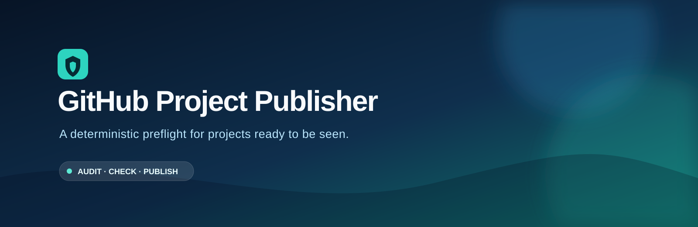
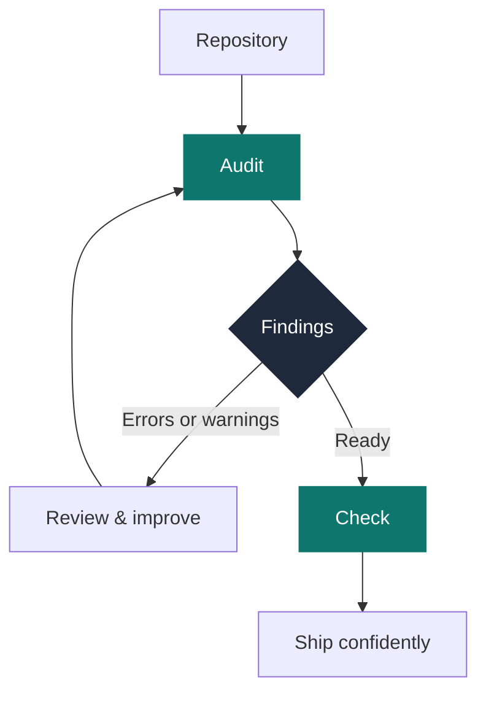
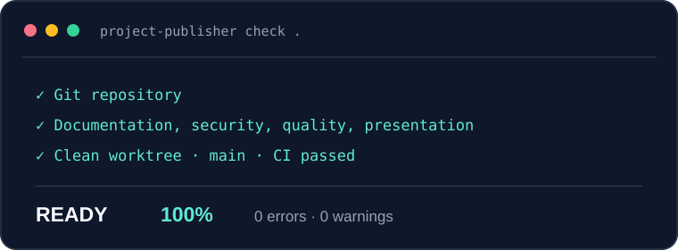
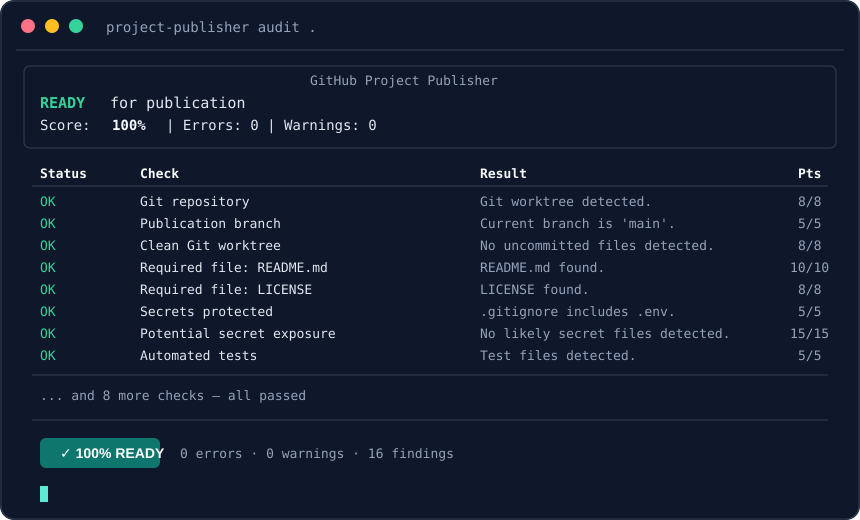
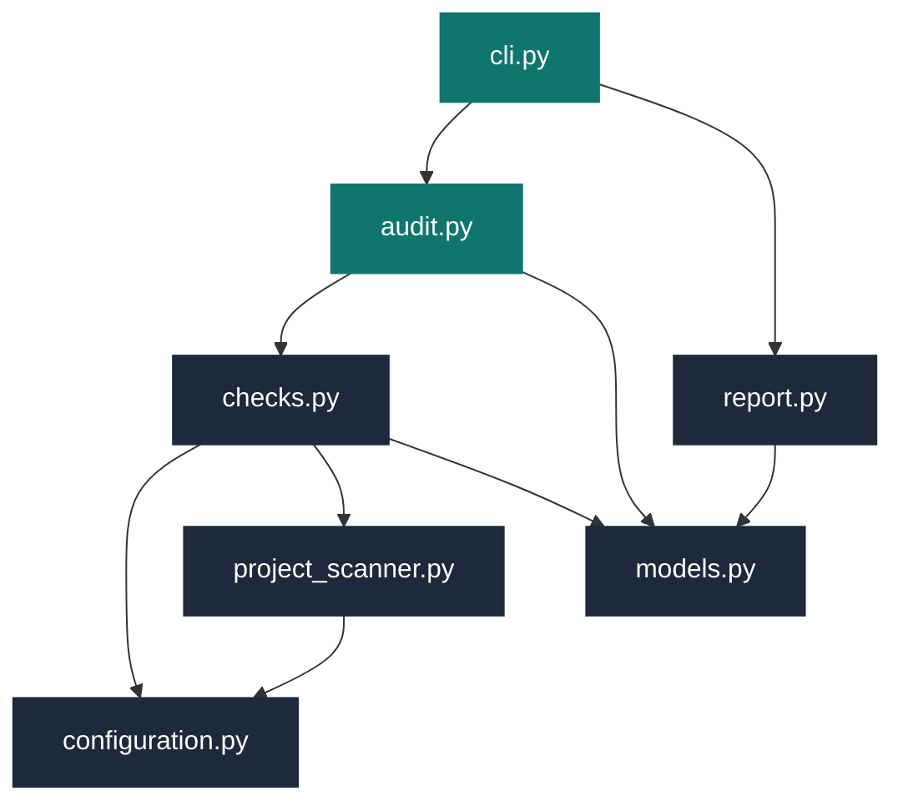

<p align="center">
  
</p>

<p align="center">
  <a href="https://github.com/everton-soares1985/github-project-publisher/actions/workflows/ci.yml"></a>
  
  <a href="LICENSE"></a>
  
</p>

<p align="center">
  <strong>Audit and validate repositories before publishing them on GitHub.</strong><br>
  A deterministic local preflight for documentation, Git hygiene, security, and release readiness.
</p>

<p align="center">
  <a href="#quickstart">Quickstart</a> ·
  <a href="#how-it-works">How it works</a> ·
  <a href="#what-it-checks">Checks</a> ·
  <a href="#architecture">Architecture</a> ·
  <a href="README.pt-BR.md">Português</a>
</p>

---

## Ship with evidence, not assumptions

Good projects are often published with missing documentation, uncommitted changes, accidental
secrets, or unclear setup instructions. GitHub Project Publisher gives you a transparent
publication gate before a repository is shared.

Version `0.1.0` is deliberately **read-only** for target repositories. It reports what needs
attention; it never changes the inspected project.

### ✨ Key Features

- 🔍 **Deep repository scan** — Git state, documentation, security, quality, presentation
- 🛡️ **Secret detection** — `.env`, private keys, credential patterns (never exposes values)
- 📊 **Readiness score** — 0–100% publication confidence with weighted protocol
- 🖥️ **Rich terminal output** — color-coded findings with Rich
- 📄 **JSON export** — `--json-output` for CI pipelines and automation
- 🔒 **Read-only by design** — never modifies the inspected project

| Command | Purpose | Result |
| --- | --- | --- |
| `project-publisher audit <path>` | Inspect a repository | Full report for review |
| `project-publisher check <path>` | Run the publication gate | Exit code `0` only when ready |

## How it works



<p align="center">
  
</p>

<p align="center"><sub>Real self-validation result on <code>main</code>. See <a href="docs/pilot-validation.md">the pilot record</a>.</sub></p>

## Quickstart

```powershell
python -m venv .venv
.venv\Scripts\activate
python -X utf8 -m pip install -e ".[dev]"

project-publisher audit C:\path\to\repository
project-publisher check C:\path\to\repository
```

Use `--json-output report.json` when a machine-readable report is needed.

### Codex skill

The repository includes a reusable Codex skill with four scoped workflows: Maintenance,
Bootstrap, Retrofit, and Release. Copy
[`skills/growthtech-github-publisher`](skills/growthtech-github-publisher) into your Codex skills
directory to install it. Maintenance is the safe default for routine fixes, commits, and pushes;
it preserves existing visual assets unless a visual change is explicitly requested.

### Example audit output

<p align="center">
  
</p>

<p align="center"><sub>Illustrative terminal output. Results vary according to the repository being audited.</sub></p>

## What it checks

| Area | Evidence collected |
| --- | --- |
| Git hygiene | Git repository, preferred branch, uncommitted changes |
| Documentation | README, license, changelog, contribution and security files |
| Security | `.env`, private keys, and likely credentials without exposing values |
| Quality | Python tests, oversized files, and unignored generated artifacts |
| Presentation | `docs/`, screenshots folder, and optional Portuguese project digest |

## Architecture



## Safety by design

`audit` and `check` do not modify the target repository. A JSON file is written only when you
explicitly provide `--json-output`. Any future `apply` mode must be designed around a separate
review-and-approval step.

## Language policy

English is the canonical language for public documentation. Projects may include a concise
[Portuguese digest](README.pt-BR.md) without duplicating the complete technical documentation.

## Development

```powershell
.venv\Scripts\activate
python -X utf8 -m pytest
python -X utf8 -m ruff check .
```

## License

MIT. See [LICENSE](LICENSE).
